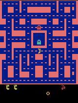
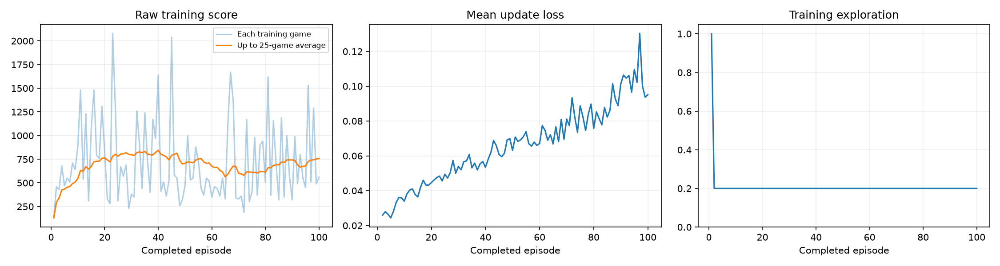

# Class 3: Train a Ms. Pac-Man Agent

The supplied DQN completed **100 training episodes**. Its mean score on the five fixed evaluation games increased from **492 to 504**: **+12 points (+2.4%)**. Two games improved and three worsened. This is a small observed gain, not convincing evidence of consistently better play.

This repository contains the [final executed notebook](pacman_dqn.ipynb), with all 28 code cells executed in order and their outputs saved, plus the evidence below. The implementation comes from [pepealonso95/pacman-dqn](https://github.com/pepealonso95/pacman-dqn). No notebook cell source was changed: the three selected settings already matched its defaults. No other hyperparameters or evaluation settings were tuned.

## Choices and expectation before training

| Setting | Choice | Reason |
| --- | ---: | --- |
| Exploration | 0.20 | Try alternative moves after warm-up while using learned action values most of the time. |
| Episode budget | 100 | Provide more experience than a five-game setup check while keeping the experiment manageable locally. |
| Learning rate | 0.0001 | Make conservative updates to reduce the risk of unstable value estimates. |

The [plan recorded before training](experiment_plan.md) expected modest improvement in collecting points, uneven results across games, and potentially unreliable ghost avoidance. Exploration was 100% for the first 1,000 training decisions, then remained at 20%.

## Actual run

| Measure | Recorded result |
| --- | --- |
| Run ID | `20260915_200035_892426` |
| Status | Completed; no interruption or failed training run |
| Episodes requested / completed | 100 / 100 |
| Training decisions | 61,219 |
| Learning updates | 15,055 |
| Training elapsed time | 295.825 seconds (4 min 55.8 sec), including periodic demos |
| Hardware | Apple M4, 16 GiB unified memory; MPS GPU |
| Runtime | Python 3.12.14; macOS 26.6.2 ARM64; PyTorch 2.14.0 |

The elapsed time above excludes package setup and the separate baseline/final evaluations. This was a real learning run, not a zero-update setup check: the trained weights differ from the untrained weights and remain finite. See [training_summary.json](results/training_summary.json), [training.csv](results/training.csv), [config.json](results/config.json), and [verification.json](results/verification.json). Full package versions are in the config and [environment.txt](results/environment.txt).

## All five evaluation games

Before and after use the same seeds, **5% exploration**, and **3,000-decision time limit**. Evaluation does not update the model. The baseline is an **untrained network**, not a random-action agent. None of these ten games reached the time limit.

| Game | Seed | Untrained score | Trained score | Change |
| --- | ---: | ---: | ---: | ---: |
| 1 | 101 | 350 | 280 | -70 |
| 2 | 202 | 500 | 550 | +50 |
| 3 | 303 | 320 | 310 | -10 |
| 4 | 404 | 800 | 620 | -180 |
| 5 | 505 | 490 | 760 | +270 |
| **Mean** | | **492** | **504** | **+12** |

Machine-readable evidence: [comparison.json](results/comparison.json). The leaderboard score for this final model is **504**. Five games and one training run do not establish a reliable general improvement.

## Gameplay evidence

Each GIF shows at most the first 20 seconds of game time, at approximately 4× playback, and plays twice. The displayed excerpt's score may be lower than the full-game score. Reload or open the GIF directly to replay it.

**Untrained network — seed 101, full-game score 350.** It already moves through corridors and collects points, including power pellets; movement alone is not evidence of learning.


**Best of the five final trained games — seed 505, full-game score 760.** The excerpt shows point collection, but also a life loss and a return to the starting area. It does not demonstrate reliable ghost avoidance. This is the best game of the final model, not a checkpoint selected across training.


The periodic samples below all use seed 101. Their full-game scores were **390, 270, 200, and 280**, respectively ([demo_scores.json](results/demo_scores.json)). They are single-game demonstrations, not five-game evaluation means.

**Episode 25 — score 390**



**Episode 50 — score 270**


**Episode 75 — score 200**


**Episode 100 — score 280**


The episode-100 excerpt visibly stalls near a corridor boundary: its score remains at 200 through roughly the last six seconds shown. The untrained excerpt also collects points, so the videos do not support a claim that training discovered competent navigation from scratch.

## Training curves and what the agent learned



The non-overlapping 25-game training averages were **782.4, 707.2, 612.4, and 758.4**. The plot's orange curve is a rolling average and shows an early rise, a decline, and a partial recovery. Training performance did not steadily improve. Training uses different seeds and 20% exploration, so these scores are not substitutes for the fixed evaluation.

Mean update loss generally increased during this run. DQN's target values change as learning proceeds, so loss is not a direct measure of gameplay quality; even a falling loss would not guarantee better play. The exploration plot records each episode's final exploration value, explaining the sharp drop when warm-up ends during episode 2.

The network learned different numerical estimates of the future reward available from each move. Its changed weights and 15,055 updates establish that learning occurred, but not that it learned a strong strategy. The evidence supports a changed, inconsistent point-collecting policy: a small increase in the five-game mean, regressions on three seeds, and persistent stalls and life losses. It does not justify claiming maze mastery or reliable ghost avoidance.

**Observations:** four consecutive grayscale game screens, each 84 × 84 pixels, let the network infer recent movement. It receives pixels rather than explicit ghost coordinates or a hand-coded map.

**Actions:** nine joystick choices: no movement, up, right, left, down, and the four diagonals. Each decision covers four emulator frames; the environment can also repeat a previous action through its unchanged sticky-action setting.

**Rewards:** game points supply the reward. Training clips each decision's reward to [-1, 1], while every reported score uses the original game points. The DQN replays stored experiences to update its predictions of immediate and discounted future reward, using a separate target network for its targets.

**Observed limitation:** the agent still stalls and loses lives, and its small average gain depends on a large improvement in just one evaluation game. The best GIF is deliberately selected and only shows an excerpt, so it is not representative of all games.

**Next experiment:** change only the episode budget from **100 to 500**, keeping exploration 0.20, learning rate 0.0001, and evaluation unchanged. This would test whether more experience improves consistent navigation. Improvement is a hypothesis, not a guarantee; compare every evaluation score again. No second run was performed.

## Open and reproduce

Open [pacman_dqn.ipynb](pacman_dqn.ipynb) on GitHub to inspect the saved outputs without rerunning, or [open it in Google Colab](https://colab.research.google.com/github/sbardacosta-code/class-3-pacman-dqn/blob/main/pacman_dqn.ipynb). In Colab, select a GPU if available, then Run All. Save the executed notebook and download its results ZIP before ending the session.

For local Jupyter or VS Code, use a Python 3.11–3.13 kernel. Keep `pacman_player.py` beside the notebook for optional popup playback; inline GIFs work without the popup. The notebook installs its packages and checks MPS, CUDA, or CPU automatically. Confirm the three values in section 1 and run all cells in order. Every run creates a new folder and ZIP under `pacman_runs/`.

For the same programmatic execution method used here:

```bash
python3.12 -m venv .venv
source .venv/bin/activate
python -m pip install -r requirements.txt
python run_notebook.py
```

[requirements.txt](requirements.txt) records the versions used in this experiment. Hardware and package changes, and GPU nondeterminism, can produce different scores even with the same seeds. The notebook's installer retains its original version ranges.

## Full archive and checkpoints

The complete original results ZIP is retained locally at **`pacman_runs/20260915_200035_892426.zip`**, with the extracted run in the matching directory. It contains `untrained.pt`, `trained.pt`, and checkpoints at episodes **25, 50, 75, and 100**, along with all notebook-generated evidence. These large models are intentionally excluded from Git; selected evidence is copied into `results/`. The ZIP's SHA-256 and successful integrity check are recorded in [verification.json](results/verification.json).

The checkpoints support playback, not exact training resumption, because they omit replay memory, optimizer state, and emulator state. The notebook embeds the actual final-run plots and GIF outputs; they have not been cleared. [provenance.json](results/provenance.json) records the supplied notebook's origin and confirms unchanged cell sources.
