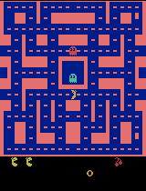

# Class 3: Ms. Pac-Man — overnight continuation of prioritized, three-step Double DQN

The validation-selected agent scored **2,536 mean raw points** on the five unchanged classroom games. Its inherited starting model scored **1,450** on the same games; the fresh untrained network scored **492**. The combined advanced attempt completed **5,996 games across two phases**, with a **6,000-game start limit**, and recorded **1,208,407 learning updates beyond the inherited model**.

The selected policy reached at least 3,000 points in **3/20** additional games, with mean **2,258.5**. The predeclared target (classroom mean ≥3,000 **and** at least 18/20 additional games ≥3,000) was **not met**. These finite evaluations do not guarantee future game scores.

The observed classroom gain over the inherited model was **+1,086.0 points**. Several changes were introduced together, so this result cannot isolate which change helped.

The [executed notebook](pacman_dqn.ipynb) contains all **28 code cells executed in order**, with their saved outputs. The supplied project is [pepealonso95/pacman-dqn](https://github.com/pepealonso95/pacman-dqn); this experiment's extensions are disclosed below.

## Choices and expectation recorded before training

| Setting | Choice | Reason |
| --- | --- | --- |
| Training exploration | 0.10 | Try alternatives around the inherited policy; constant after random warm-up. |
| Total advanced episode-start budget | 6,000 | Continue the same learner within the newly authorized overnight window; includes both phases. |
| Learning rate | 0.00005 | Use smaller updates while fine-tuning with prioritized, longer-horizon targets. |

The original [pre-training plan](experiment_plan.md) expected more efficient learning, safer choices, and higher typical scores. During its unchanged first phase, the student explicitly authorized approximately **six more hours overnight**, superseding the former three-hour overall limit. The frozen [overnight amendment](overnight_plan.md) increases the total advanced episode-start budget from 2,500 to 6,000 while retaining exploration 0.10, learning rate 0.00005, and the same learning/evaluation methods.

The extension was authorized at approximately **08:07 UTC on September 21, 2026**. Its planned training cutoff is **13:37 UTC**, reserving approximately 30 minutes for evaluation, saving, and publication before **14:07 UTC**. These are the authorized schedule boundaries; actual phase timing is reported below.

The student authorized the extension **before** the first 250-game development result arrived. That later candidate averaged approximately 1,194 raw points versus approximately 1,199 for the inherited model on the ten development seeds. Those are means, not the mean-minus-variability selection metric. This was flat development performance. The longer budget came from the student's authorization, not a change to the classroom test or a claim that more training guarantees improvement.

The network starts from the previous scaled-reward model, which had already received **1,069 completed games, 744,500 decisions, and 185,875 recorded updates**. Its optimizer and replay were reset only at the beginning of phase one. Phase two restores the actual last phase-one learner, optimizer, target network, replay, and random states, rather than reinitializing them or restarting from the best selected checkpoint. The source run's separately documented interruption uncertainty remains in its archived evidence; inherited updates here are the recorded count.

## Disclosed training extensions

| Extension | Setting and purpose |
| --- | --- |
| Three-step returns | n=3, gamma=0.99; use up to three rewards and the actual future four-frame stack. |
| Prioritized replay | 50,000 transitions; alpha=0.5. Sample surprising transitions more often and apply importance correction. |
| Importance correction | Beta begins at 0.4 and approaches 1.0 over 2,000,000 new decisions; reached 1.0000 in this attempt. |
| Training reward | raw game points × 0.01 − 0.5 × lives lost; no clipping. Losing a life costs the equivalent of 50 points during training. |
| Replay collection | First 1,000 new decisions are random; collect 10,000 decisions before learning. Exploration then stays at 10%. |
| Four training games | Batch action predictions across four environments. One shared learner update per four aggregate decisions; batch size 32. |
| Target network | Double DQN; synchronize the target every 1,000 new decisions. Network architecture is unchanged. |
| Episode boundaries | Life loss does not terminate the game or TD target. True game over ends bootstrap; a time limit retains it. |

Four environments improve batching; they do not multiply the reported decision or update counts. Training seeds continue beyond the source run using `42 + 1069 + additional_game_id`. Phase two retains the global decision, update, and game-start counters, so random warm-up, replay filling, beta annealing, target synchronization, and validation milestones do not restart. The replay stores full current and future image stacks, approximately 2.63 GiB at capacity. Neither RAM observations nor ghost coordinates are supplied to the policy.

The design draws on [Prioritized Experience Replay](https://arxiv.org/abs/1511.05952), [Rainbow](https://arxiv.org/abs/1710.02298), and [Revisiting the Arcade Learning Environment](https://arxiv.org/abs/1709.06009). This is a small adaptation, not a reproduction of their large-budget results. Bundling replay, return length, reward shaping, and batching prevents an isolated causal claim about any one change.

## Actual training budget and selected model

**Status: `completed`.** The episode-start budget finished with no active final games. 6,000 of 6,000 allowed advanced games were started; 5,996 completed. Abandoned phase-one games are not counted as completed.

| Budget | Completed games | Decisions | Recorded learning updates |
| --- | --- | --- | --- |
| Inherited training | 1,069 | 744,500 | 185,875 |
| Combined advanced attempt: phases one + two | 5,996 | 4,843,626 | 1,208,407 |
| Original inheritance + combined advanced attempt | 7,065 | 5,588,126 | 1,394,282 |
| New work retained in selected candidate | 4,250 | 3,391,891 | 845,473 |
| Inherited + selected candidate | 5,319 | 4,136,391 | 1,031,348 |

The combined attempt measures compute spent across both phases without counting carried counters twice; the selected-candidate rows measure training retained in the submitted policy. Candidate snapshots can include decisions from parallel games that had not yet completed. The selected checkpoint can precede the end of the attempt.

### Two phases and restoration provenance

| Phase | Games started | Games completed | Decisions | Recorded updates | Recorded elapsed time |
| --- | --- | --- | --- | --- | --- |
| Phase one: `20260921_005003_092029` | 1,979 | 1,975 | 1,535,392 | 381,349 | 2 h 0 min 0.0 sec (7,200.011 seconds) |
| Phase two only: `20260921_025203_850824` | 4,021 | 4,021 | 3,308,234 | 827,058 | 3 h 22 min 13.5 sec (12,133.507 seconds) |
| Combined advanced work | 6,000 | 5,996 | 4,843,626 | 1,208,407 | 5 h 22 min 13.5 sec (19,333.518 seconds) |

Phase one ended with status **`time_budget`**; phase two/final status is **`completed`**. The phase-two row contains differences from the carried phase-one counters, so restoration itself creates no extra episodes or learning updates. The original 1,069-game model remains separate inheritance above.

Phase-two preparation was recorded at **`2026-09-21T09:51:55.282041+00:00`**. The supervisor's training deadline was **`2026-09-21T13:37:00+00:00`**, with a relative phase-two allowance of **3 h 43 min 4.0 sec (13,384.000 seconds)** and a **120-second startup reserve**. Preparation time and the authorization-to-finalization window are not additional training periods to add to the table. Phase one began before the six-more-hours authorization.

Phase two restored the **last learner** and its Adam optimizer, target, replay, priorities, and random states. The incumbent selected checkpoint and full ten-seed selection history were carried separately. The final policy may therefore be inherited, a phase-one candidate, or a phase-two candidate; selection never forces the latest weights to win.

Because emulator states were unavailable, **4 phase-one partial games** were abandoned and **8 pending n-step items** were cleared. Already emitted replay transitions remain. Fresh games begin after the previous `episodes_started` counter, avoiding seed reuse. This restores learning state, but it is **not exact mid-game resumption**.

Source evidence: [phase-one executed notebook](experiments/overnight_phase1/pacman_dqn.ipynb), [phase-one results](experiments/overnight_phase1/results/), and [overnight_provenance.json](results/overnight_provenance.json).

| Measure | Recorded value |
| --- | --- |
| Run ID | `20260921_025203_850824` |
| Additional games started / completed | 6,000 / 5,996 |
| Combined recorded training periods | 5 h 22 min 13.5 sec (19,333.518 seconds) |
| Combined monotonic elapsed time | 5 h 22 min 13.4 sec (19,333.433 seconds) |
| Phase-two monotonic elapsed time | 3 h 22 min 13.5 sec (12,133.479 seconds) |
| Final summary's recorded training cap | 5 h 43 min 4.0 sec (20,584.011 seconds) |
| Training device | MPS |
| Host hardware recorded by additional evaluation | Apple M4; 16 GiB memory |
| Python / PyTorch | 3.12.14 / 2.14.0 |
| Platform | macOS-26.6.2-arm64-arm-64bit |
| Replay entries at stop | 50,000 |
| Lives lost in new training | 17,988 |

Recorded training periods include collection, updates, periodic GIF/checkpoint work, and selection evaluations performed inside training. The phase-two timer also includes restoration and display of copied phase-one GIFs because it starts at the top of the continuation cell. They exclude each phase's final selection evaluation, final snapshot/ZIP saving, and final classroom/additional evaluations. Fresh/inherited classroom evaluation before training and external preparation/finalization are also separate. The six-hour authorization is an overall wall-clock allowance, not a claim that six hours of optimizer work occurred. Package details: [config.json](results/config.json) and [environment.txt](results/environment.txt).

Parallel-game accounting: **4,843,060 completed-game decisions + 566 decisions in 4 abandoned phase-one games + 0 decisions in 0 final active games = 4,843,626 new decisions**. Partial-game scores are not inserted as completed training CSV rows.

| State | Slot | Training game ID | Seed | Partial decisions | Raw score | Lives lost |
| --- | --- | --- | --- | --- | --- | --- |
| Abandoned after phase one | 0 | 1979 | 3090 | 27 | 0 | 0 |
| Abandoned after phase one | 1 | 1978 | 3089 | 76 | 30 | 0 |
| Abandoned after phase one | 2 | 1977 | 3088 | 171 | 180 | 0 |
| Abandoned after phase one | 3 | 1976 | 3087 | 292 | 450 | 0 |

Update accounting: **1,208,407 recorded** versus **1,208,407 scheduled**. Global scheduling continues from phase 1 without a second replay-fill delay. 0 uncertain scheduled update(s) were inherited and 0 occurred at the new interruption boundary. Recorded counters are retained; no extra completed update is inferred.

Budget evidence: [training_summary.json](results/training_summary.json), [training.csv](results/training.csv), and [verification.json](results/verification.json).

## All five classroom games

These scores use the same seeds, **5% exploration**, **3,000-decision limit**, preprocessing, and sticky-action settings before and after training. Evaluations do not learn. The fresh baseline is an untrained network, not a random-action agent. The inherited-model column separates previous learning from this attempt.

| Game | Seed | Fresh untrained | Inherited model | Selected model | Selected − inherited |
| --- | --- | --- | --- | --- | --- |
| 1 | 101 | 350 | 1,430 | 2,750 | +1,320.0 |
| 2 | 202 | 500 | 1,050 | 1,740 | +690.0 |
| 3 | 303 | 320 | 1,860 | 4,300 | +2,440.0 |
| 4 | 404 | 800 | 1,930 | 2,480 | +550.0 |
| 5 | 505 | 490 | 980 | 1,410 | +430.0 |
| **Mean** |  | **492** | **1,450** | **2,536** | **+1,086.0** |

The class leaderboard value for this selected model is **2,536**. Time-limited games: 0/5 fresh, 0/5 inherited, 0/5 selected. All points are raw game points, not training rewards. Machine-readable results: [comparison.json](results/comparison.json) and [warm_start_evaluation.json](results/warm_start_evaluation.json).

The earlier [clipped-reward 2,000-game experiment](experiments/clipped_2000/README.md) scored **1,582** on these five seeds; this submission differs by **+954.0** points. That earlier model is not the warm-start source used here.

## Checkpoint selection on separate validation games

Candidates were evaluated on seeds **20001–20010** before new learning, every 250 completed advanced games, and at each phase's end. Phase-one history and the incumbent persist into phase two. The predeclared selection metric is **mean raw score − 0.5 × population standard deviation**. Higher wins; ties retain the earlier candidate. This variability penalty is a heuristic, not a confidence bound. Classroom scores and the later 20-game evaluation did not select the checkpoint.

The ten-score column is ordered by seeds 20001, 20002, …, 20010.

| Additional games | Decisions | Updates | All ten scores | Mean | Population SD | Metric | Outcome / reason |
| --- | --- | --- | --- | --- | --- | --- | --- |
| 0 | 0 | 0 | 1080, 1310, 1010, 990, 770, 900, 1010, 2390, 780, 1750 | 1,199 | 480.9 | 958.5 | inherited starting model |
| 250 | 187,700 | 44,426 | 660, 640, 1580, 990, 1230, 950, 2280, 1350, 1610, 650 | 1,194 | 501.6 | 943.2 | periodic |
| 500 | 377,611 | 91,903 | 1370, 1220, 1690, 1460, 250, 930, 1390, 1180, 2610, 710 | 1,281 | 592.6 | 984.7 | periodic |
| 750 | 566,505 | 139,127 | 4030, 960, 1200, 2330, 1380, 1450, 1560, 780, 2280, 1200 | 1,717 | 907.6 | 1,263.2 | periodic |
| 1000 | 761,166 | 187,792 | 1490, 3130, 1980, 1900, 810, 2640, 430, 1130, 790, 2810 | 1,711 | 887.7 | 1,267.2 | periodic |
| 1250 | 957,258 | 236,815 | 2930, 1560, 2700, 1770, 410, 2440, 3810, 1640, 1570, 3240 | 2,207 | 949.9 | 1,732.1 | periodic |
| 1500 | 1,155,444 | 286,362 | 890, 700, 1050, 1240, 760, 2000, 970, 1750, 2980, 1040 | 1,338 | 675.5 | 1,000.3 | periodic |
| 1750 | 1,356,637 | 336,660 | 1860, 2750, 1280, 2440, 710, 1740, 480, 1320, 4630, 2120 | 1,933 | 1,126.3 | 1,369.9 | periodic |
| 1975 | 1,535,392 | 381,349 | 1400, 910, 3680, 1380, 1480, 2640, 1390, 530, 1840, 1080 | 1,633 | 865.6 | 1,200.2 | final candidate |
| 2000 | 1,556,452 | 386,614 | 1340, 1310, 2820, 4000, 900, 2080, 1390, 2310, 1280, 1280 | 1,871 | 902.2 | 1,419.9 | periodic |
| 2250 | 1,756,817 | 436,705 | 1380, 1070, 1800, 1540, 1770, 1680, 1330, 1300, 950, 2400 | 1,522 | 396.6 | 1,323.7 | periodic |
| 2500 | 1,955,974 | 486,494 | 1630, 2020, 1160, 2430, 1240, 1780, 1160, 820, 1570, 1420 | 1,523 | 447.0 | 1,299.5 | periodic |
| 2750 | 2,164,210 | 538,553 | 1350, 1140, 1270, 4000, 1390, 2390, 1000, 1570, 2360, 2850 | 1,932 | 906.1 | 1,479.0 | periodic |
| 3000 | 2,365,877 | 588,970 | 2690, 1960, 1170, 1260, 1320, 2510, 2700, 1120, 2580, 2430 | 1,974 | 649.3 | 1,649.4 | periodic |
| 3250 | 2,568,778 | 639,695 | 2600, 2470, 2010, 1870, 720, 2850, 970, 2400, 2850, 4790 | 2,353 | 1,069.6 | 1,818.2 | periodic |
| 3500 | 2,770,917 | 690,230 | 2680, 2570, 2310, 2030, 820, 2360, 1260, 2310, 2850, 2560 | 2,175 | 614.8 | 1,867.6 | periodic |
| 3750 | 2,975,967 | 741,492 | 2490, 1390, 1860, 1170, 1650, 2130, 1260, 2030, 5070, 3160 | 2,221 | 1,108.6 | 1,666.7 | periodic |
| 4000 | 3,185,583 | 793,896 | 3110, 2010, 2550, 1330, 620, 1080, 950, 1740, 2540, 2520 | 1,845 | 789.1 | 1,450.5 | periodic |
| 4250 | 3,391,891 | 845,473 | 2670, 1740, 1490, 2060, 3980, 3360, 2600, 2000, 1550, 1420 | 2,287 | 814.0 | 1,880.0 | **Selected** |
| 4500 | 3,602,377 | 898,095 | 1820, 2690, 1690, 930, 890, 2330, 1650, 2740, 4290, 2350 | 2,138 | 945.3 | 1,665.3 | periodic |
| 4750 | 3,809,275 | 949,819 | 2610, 1340, 1610, 1620, 1640, 3790, 1750, 2390, 1950, 1930 | 2,063 | 679.7 | 1,723.1 | periodic |
| 5000 | 4,020,773 | 1,002,694 | 1570, 1800, 3090, 1460, 1030, 1870, 1490, 940, 1520, 2820 | 1,759 | 660.9 | 1,428.5 | periodic |
| 5250 | 4,228,756 | 1,054,690 | 1410, 2650, 3040, 1280, 1520, 1510, 1830, 1570, 1250, 2380 | 1,844 | 593.2 | 1,547.4 | periodic |
| 5500 | 4,428,107 | 1,104,527 | 2920, 2130, 2620, 1810, 840, 1150, 1640, 2360, 2610, 3200 | 2,128 | 725.2 | 1,765.4 | periodic |
| 5750 | 4,642,228 | 1,158,058 | 2820, 2420, 1220, 2900, 780, 2290, 2300, 3240, 1430, 1660 | 2,106 | 761.3 | 1,725.4 | periodic |
| 5996 | 4,843,626 | 1,208,407 | 1090, 1580, 4250, 3950, 1960, 3150, 1650, 2580, 1640, 1230 | 2,308 | 1,068.9 | 1,773.5 | final candidate |

Selected: **4,250 additional completed games**, **845,473 additional recorded updates**, metric **1,880.0**. Full record: [model_selection.json](results/model_selection.json). The saved `trained.pt` is this selected model; `last_trained.pt` preserves the final attempted learner separately.

## Twenty additional games: consistency check

After checkpoint selection, the inherited and selected models were each evaluated on seeds **30001–30020**, disjoint from training, selection, and classroom seeds. They use the unchanged 5% exploration and 3,000-decision cap. No weight updates occurred. These 40 scores do not replace the five classroom scores.

| Measure | Inherited | Selected |
| --- | --- | --- |
| Mean | 1,291 | 2,258.5 |
| Median | 1,080 | 2,330 |
| Minimum | 670 | 680 |
| Maximum | 3,670 | 4,700 |
| Games ≥3,000 | 1/20 | 3/20 |
| Fraction ≥3,000 | 5% | 15% |
| Time-limited games | 0/20 | 0/20 |

| Seed | Inherited raw score | Selected raw score | Change |
| --- | --- | --- | --- |
| 30001 | 2,750 | 3,120 | +370.0 |
| 30002 | 750 | 680 | -70.0 |
| 30003 | 880 | 4,700 | +3,820.0 |
| 30004 | 670 | 1,420 | +750.0 |
| 30005 | 1,800 | 2,360 | +560.0 |
| 30006 | 1,860 | 1,120 | -740.0 |
| 30007 | 3,670 | 1,770 | -1,900.0 |
| 30008 | 1,300 | 2,870 | +1,570.0 |
| 30009 | 1,220 | 1,130 | -90.0 |
| 30010 | 670 | 2,770 | +2,100.0 |
| 30011 | 750 | 1,700 | +950.0 |
| 30012 | 1,610 | 2,800 | +1,190.0 |
| 30013 | 770 | 740 | -30.0 |
| 30014 | 960 | 2,300 | +1,340.0 |
| 30015 | 1,080 | 2,500 | +1,420.0 |
| 30016 | 1,180 | 1,480 | +300.0 |
| 30017 | 1,080 | 2,270 | +1,190.0 |
| 30018 | 950 | 2,370 | +1,420.0 |
| 30019 | 1,110 | 2,930 | +1,820.0 |
| 30020 | 760 | 4,140 | +3,380.0 |

| Score range | Inherited game count | Selected game count |
| --- | --- | --- |
| Below 1,000 | 9 | 2 |
| 1,000–1,999 | 9 | 6 |
| 2,000–2,999 | 1 | 9 |
| 3,000 or more | 1 | 3 |

The additional-game mean changed by **+967.5 points**. Operational target: **not met**. A high maximum alone does not establish consistency. Data and unchanged-weight checks: [validation.json](results/validation.json), [validation.csv](results/validation.csv).

## Gameplay evidence

Each GIF shows at most the first 20 seconds of game time, approximately 4× playback, and plays twice. Full-game scores below can therefore exceed the score visible in the excerpt. The final GIF is the best of the selected model's five classroom games, not an average game or a model chosen using those scores.

**Fresh untrained network — seed 101, full-game score 350.**


**Selected model — best classroom game, seed 303, full-game score 4,300.** This model retains 4,250 additional completed games of training.


In the untrained clip, Ms. Pac-Man moves right and upward, then stays near the upper-left corner in the late sampled frames while many pellets remain. The selected model's best clip follows corridors through the lower-right, right side, and upper-left of the maze, removing visible pellets along its route. Its visible score reaches 3,770 near the end of the excerpt; the complete game scored 4,300. The 4,250-game intermediate clip reaches 1,790 visible points, whereas the later 5,750-game clip reaches only about 980 in its excerpt. More training did not improve every demonstration. These observations come from evenly spaced frames across the actual GIFs. The best clip does not show the lower-scoring games and cannot establish reliable ghost avoidance, fruit seeking, or maze mastery; the full evaluation scores measure that inconsistency.

The periodic GIFs below span both phases and show the current learner every 25 completed advanced games, using the preserved global completion counter. They all use seed 101 and are demonstrations only. They may occur after the eventually selected checkpoint; those later GIFs do not depict the submitted policy. Full scores: [demo_scores.json](results/demo_scores.json).

<details>
<summary>Expand all intermediate gameplay GIFs (every 25 completed games)</summary>

**After 25 additional games — seed 101, score 730.**


**After 50 additional games — seed 101, score 920.**


**After 75 additional games — seed 101, score 680.**


**After 100 additional games — seed 101, score 1,100.**


**After 125 additional games — seed 101, score 800.**


**After 150 additional games — seed 101, score 1,240.**


**After 175 additional games — seed 101, score 1,370.**


**After 200 additional games — seed 101, score 1,270.**


**After 225 additional games — seed 101, score 1,110.**


**After 250 additional games — seed 101, score 430.**


**After 275 additional games — seed 101, score 1,130.**


**After 300 additional games — seed 101, score 1,340.**


**After 325 additional games — seed 101, score 880.**


**After 350 additional games — seed 101, score 1,810.**


**After 375 additional games — seed 101, score 830.**


**After 400 additional games — seed 101, score 2,090.**


**After 425 additional games — seed 101, score 2,070.**


**After 450 additional games — seed 101, score 1,540.**


**After 475 additional games — seed 101, score 2,550.**


**After 500 additional games — seed 101, score 2,950.**


**After 525 additional games — seed 101, score 750.**


**After 550 additional games — seed 101, score 1,900.**


**After 575 additional games — seed 101, score 1,310.**


**After 600 additional games — seed 101, score 1,440.**


**After 625 additional games — seed 101, score 990.**


**After 650 additional games — seed 101, score 1,250.**


**After 675 additional games — seed 101, score 1,190.**


**After 700 additional games — seed 101, score 1,630.**


**After 725 additional games — seed 101, score 710.**


**After 750 additional games — seed 101, score 1,220.**


**After 775 additional games — seed 101, score 1,410.**


**After 800 additional games — seed 101, score 2,220.**


**After 825 additional games — seed 101, score 1,270.**


**After 850 additional games — seed 101, score 1,090.**


**After 875 additional games — seed 101, score 1,500.**


**After 900 additional games — seed 101, score 900.**


**After 925 additional games — seed 101, score 1,000.**


**After 950 additional games — seed 101, score 1,090.**


**After 975 additional games — seed 101, score 670.**


**After 1,000 additional games — seed 101, score 2,470.**


**After 1,025 additional games — seed 101, score 1,390.**


**After 1,050 additional games — seed 101, score 2,490.**


**After 1,075 additional games — seed 101, score 1,780.**


**After 1,100 additional games — seed 101, score 1,480.**


**After 1,125 additional games — seed 101, score 1,820.**


**After 1,150 additional games — seed 101, score 1,310.**


**After 1,175 additional games — seed 101, score 1,190.**


**After 1,200 additional games — seed 101, score 1,720.**


**After 1,225 additional games — seed 101, score 2,420.**


**After 1,250 additional games — seed 101, score 2,500.**


**After 1,275 additional games — seed 101, score 2,090.**


**After 1,300 additional games — seed 101, score 2,930.**


**After 1,325 additional games — seed 101, score 1,820.**


**After 1,350 additional games — seed 101, score 1,750.**


**After 1,375 additional games — seed 101, score 1,490.**


**After 1,400 additional games — seed 101, score 2,540.**


**After 1,425 additional games — seed 101, score 2,070.**


**After 1,450 additional games — seed 101, score 2,940.**


**After 1,475 additional games — seed 101, score 1,610.**


**After 1,500 additional games — seed 101, score 2,370.**


**After 1,525 additional games — seed 101, score 1,710.**


**After 1,550 additional games — seed 101, score 2,620.**


**After 1,575 additional games — seed 101, score 1,320.**


**After 1,600 additional games — seed 101, score 1,760.**


**After 1,625 additional games — seed 101, score 2,280.**


**After 1,650 additional games — seed 101, score 4,460.**


**After 1,675 additional games — seed 101, score 1,840.**


**After 1,700 additional games — seed 101, score 1,020.**


**After 1,725 additional games — seed 101, score 3,080.**


**After 1,750 additional games — seed 101, score 930.**


**After 1,775 additional games — seed 101, score 1,510.**


**After 1,800 additional games — seed 101, score 1,700.**


**After 1,825 additional games — seed 101, score 1,160.**


**After 1,850 additional games — seed 101, score 1,000.**


**After 1,875 additional games — seed 101, score 720.**


**After 1,900 additional games — seed 101, score 2,110.**


**After 1,925 additional games — seed 101, score 1,280.**


**After 1,950 additional games — seed 101, score 2,950.**


**After 1,975 additional games — seed 101, score 840.**


**After 2,000 additional games — seed 101, score 2,760.**


**After 2,025 additional games — seed 101, score 1,740.**



**After 2,050 additional games — seed 101, score 2,270.**


**After 2,075 additional games — seed 101, score 1,260.**


**After 2,100 additional games — seed 101, score 1,620.**


**After 2,125 additional games — seed 101, score 2,500.**


**After 2,150 additional games — seed 101, score 1,300.**


**After 2,175 additional games — seed 101, score 1,170.**


**After 2,200 additional games — seed 101, score 670.**


**After 2,225 additional games — seed 101, score 1,620.**


**After 2,250 additional games — seed 101, score 1,630.**


**After 2,275 additional games — seed 101, score 3,240.**


**After 2,300 additional games — seed 101, score 1,530.**


**After 2,325 additional games — seed 101, score 2,260.**


**After 2,350 additional games — seed 101, score 3,080.**


**After 2,375 additional games — seed 101, score 1,490.**


**After 2,400 additional games — seed 101, score 1,910.**


**After 2,425 additional games — seed 101, score 1,650.**


**After 2,450 additional games — seed 101, score 1,740.**


**After 2,475 additional games — seed 101, score 2,370.**


**After 2,500 additional games — seed 101, score 3,150.**


**After 2,525 additional games — seed 101, score 1,810.**


**After 2,550 additional games — seed 101, score 1,150.**


**After 2,575 additional games — seed 101, score 1,480.**


**After 2,600 additional games — seed 101, score 1,320.**


**After 2,625 additional games — seed 101, score 1,850.**


**After 2,650 additional games — seed 101, score 2,560.**


**After 2,675 additional games — seed 101, score 1,740.**


**After 2,700 additional games — seed 101, score 2,220.**


**After 2,725 additional games — seed 101, score 1,710.**


**After 2,750 additional games — seed 101, score 2,300.**


**After 2,775 additional games — seed 101, score 1,210.**


**After 2,800 additional games — seed 101, score 2,290.**


**After 2,825 additional games — seed 101, score 1,510.**


**After 2,850 additional games — seed 101, score 1,930.**


**After 2,875 additional games — seed 101, score 970.**


**After 2,900 additional games — seed 101, score 1,790.**


**After 2,925 additional games — seed 101, score 1,800.**


**After 2,950 additional games — seed 101, score 1,160.**


**After 2,975 additional games — seed 101, score 1,140.**


**After 3,000 additional games — seed 101, score 1,610.**


**After 3,025 additional games — seed 101, score 1,470.**


**After 3,050 additional games — seed 101, score 2,830.**


**After 3,075 additional games — seed 101, score 2,600.**


**After 3,100 additional games — seed 101, score 1,690.**


**After 3,125 additional games — seed 101, score 1,410.**


**After 3,150 additional games — seed 101, score 1,710.**


**After 3,175 additional games — seed 101, score 2,580.**


**After 3,200 additional games — seed 101, score 2,310.**


**After 3,225 additional games — seed 101, score 2,330.**


**After 3,250 additional games — seed 101, score 1,620.**


**After 3,275 additional games — seed 101, score 1,990.**


**After 3,300 additional games — seed 101, score 2,630.**


**After 3,325 additional games — seed 101, score 2,500.**


**After 3,350 additional games — seed 101, score 1,720.**


**After 3,375 additional games — seed 101, score 1,810.**


**After 3,400 additional games — seed 101, score 1,400.**


**After 3,425 additional games — seed 101, score 1,290.**


**After 3,450 additional games — seed 101, score 1,730.**


**After 3,475 additional games — seed 101, score 2,700.**


**After 3,500 additional games — seed 101, score 790.**


**After 3,525 additional games — seed 101, score 2,550.**


**After 3,550 additional games — seed 101, score 2,020.**


**After 3,575 additional games — seed 101, score 3,660.**


**After 3,600 additional games — seed 101, score 1,880.**


**After 3,625 additional games — seed 101, score 2,830.**


**After 3,650 additional games — seed 101, score 4,050.**


**After 3,675 additional games — seed 101, score 1,520.**


**After 3,700 additional games — seed 101, score 2,500.**


**After 3,725 additional games — seed 101, score 1,340.**


**After 3,750 additional games — seed 101, score 1,710.**


**After 3,775 additional games — seed 101, score 1,910.**


**After 3,800 additional games — seed 101, score 2,730.**


**After 3,825 additional games — seed 101, score 1,060.**


**After 3,850 additional games — seed 101, score 4,060.**


**After 3,875 additional games — seed 101, score 980.**


**After 3,900 additional games — seed 101, score 3,170.**


**After 3,925 additional games — seed 101, score 1,310.**


**After 3,950 additional games — seed 101, score 2,460.**


**After 3,975 additional games — seed 101, score 1,580.**


**After 4,000 additional games — seed 101, score 1,050.**


**After 4,025 additional games — seed 101, score 3,280.**


**After 4,050 additional games — seed 101, score 1,400.**


**After 4,075 additional games — seed 101, score 1,470.**


**After 4,100 additional games — seed 101, score 2,720.**


**After 4,125 additional games — seed 101, score 1,760.**


**After 4,150 additional games — seed 101, score 2,580.**


**After 4,175 additional games — seed 101, score 3,270.**


**After 4,200 additional games — seed 101, score 4,240.**


**After 4,225 additional games — seed 101, score 3,370.**


**After 4,250 additional games — seed 101, score 2,750.**


**After 4,275 additional games — seed 101, score 2,660.**


**After 4,300 additional games — seed 101, score 2,350.**


**After 4,325 additional games — seed 101, score 4,020.**


**After 4,350 additional games — seed 101, score 4,000.**


**After 4,375 additional games — seed 101, score 2,050.**


**After 4,400 additional games — seed 101, score 2,010.**


**After 4,425 additional games — seed 101, score 2,390.**


**After 4,450 additional games — seed 101, score 2,980.**


**After 4,475 additional games — seed 101, score 2,680.**


**After 4,500 additional games — seed 101, score 1,440.**


**After 4,525 additional games — seed 101, score 3,060.**


**After 4,550 additional games — seed 101, score 2,290.**


**After 4,575 additional games — seed 101, score 2,400.**


**After 4,600 additional games — seed 101, score 1,490.**


**After 4,625 additional games — seed 101, score 3,150.**


**After 4,650 additional games — seed 101, score 2,600.**


**After 4,675 additional games — seed 101, score 2,620.**


**After 4,700 additional games — seed 101, score 1,620.**


**After 4,725 additional games — seed 101, score 2,560.**


**After 4,750 additional games — seed 101, score 2,500.**


**After 4,775 additional games — seed 101, score 1,640.**


**After 4,800 additional games — seed 101, score 1,830.**


**After 4,825 additional games — seed 101, score 2,510.**


**After 4,850 additional games — seed 101, score 2,490.**


**After 4,875 additional games — seed 101, score 1,060.**


**After 4,900 additional games — seed 101, score 1,710.**


**After 4,925 additional games — seed 101, score 1,500.**


**After 4,950 additional games — seed 101, score 2,250.**


**After 4,975 additional games — seed 101, score 1,980.**


**After 5,000 additional games — seed 101, score 2,780.**


**After 5,025 additional games — seed 101, score 4,190.**


**After 5,050 additional games — seed 101, score 2,610.**


**After 5,075 additional games — seed 101, score 2,510.**


**After 5,100 additional games — seed 101, score 2,980.**


**After 5,125 additional games — seed 101, score 1,840.**


**After 5,150 additional games — seed 101, score 2,130.**


**After 5,175 additional games — seed 101, score 2,130.**


**After 5,200 additional games — seed 101, score 2,420.**


**After 5,225 additional games — seed 101, score 2,850.**


**After 5,250 additional games — seed 101, score 3,150.**


**After 5,275 additional games — seed 101, score 1,160.**


**After 5,300 additional games — seed 101, score 1,770.**


**After 5,325 additional games — seed 101, score 1,310.**


**After 5,350 additional games — seed 101, score 2,140.**


**After 5,375 additional games — seed 101, score 2,270.**


**After 5,400 additional games — seed 101, score 1,520.**


**After 5,425 additional games — seed 101, score 3,130.**


**After 5,450 additional games — seed 101, score 1,890.**


**After 5,475 additional games — seed 101, score 3,500.**


**After 5,500 additional games — seed 101, score 2,300.**


**After 5,525 additional games — seed 101, score 1,920.**


**After 5,550 additional games — seed 101, score 980.**


**After 5,575 additional games — seed 101, score 2,610.**


**After 5,600 additional games — seed 101, score 1,680.**


**After 5,625 additional games — seed 101, score 3,160.**


**After 5,650 additional games — seed 101, score 1,870.**


**After 5,675 additional games — seed 101, score 1,600.**


**After 5,700 additional games — seed 101, score 1,230.**


**After 5,725 additional games — seed 101, score 1,550.**


**After 5,750 additional games — seed 101, score 2,250.**


**After 5,775 additional games — seed 101, score 2,460.**


**After 5,800 additional games — seed 101, score 2,720.**


**After 5,825 additional games — seed 101, score 1,120.**


**After 5,850 additional games — seed 101, score 2,790.**


**After 5,875 additional games — seed 101, score 980.**


**After 5,900 additional games — seed 101, score 2,040.**


**After 5,925 additional games — seed 101, score 2,470.**


**After 5,950 additional games — seed 101, score 2,160.**


**After 5,975 additional games — seed 101, score 2,550.**


</details>

## Training curves and what the policy learned


The dashboard shows raw training scores and the rolling average of up to 25 games, mean learning loss, and exploration. The green dashed marker identifies the validation-selected checkpoint. Each CSV row is a completed game, ordered by completion across four environments. Its `mean_loss` averages **shared learner updates during that game's lifetime**; overlapping games can include the same updates, so it is not loss attributable only to that game. Exploration records the value when the game completed, which can hide the early random warm-up within the first few games.

| Completed additional games | Mean raw training score | Mean decisions per game |
| --- | --- | --- |
| 1–250 | 1,204.9 | 745.1 |
| 251–500 | 1,291.2 | 758.5 |
| 501–750 | 1,353.2 | 757.0 |
| 751–1000 | 1,445.9 | 782.4 |
| 1001–1250 | 1,690.6 | 779.1 |
| 1251–1500 | 1,719.7 | 797.0 |
| 1501–1750 | 1,707.9 | 801.6 |
| 1751–2000 | 1,771.4 | 798.1 |
| 2001–2250 | 1,737.0 | 798.0 |
| 2251–2500 | 1,643.4 | 800.4 |
| 2501–2750 | 1,703.7 | 831.5 |
| 2751–3000 | 1,643.6 | 805.2 |
| 3001–3250 | 1,851.8 | 812.9 |
| 3251–3500 | 1,770.4 | 808.3 |
| 3501–3750 | 1,785.5 | 818.9 |
| 3751–4000 | 1,814.1 | 842.5 |
| 4001–4250 | 1,923.2 | 824.4 |
| 4251–4500 | 1,981.8 | 837.5 |
| 4501–4750 | 1,913.2 | 830.6 |
| 4751–5000 | 1,880.2 | 845.7 |
| 5001–5250 | 2,005.4 | 833.6 |
| 5251–5500 | 1,649.6 | 799.4 |
| 5501–5750 | 2,046.7 | 853.6 |
| 5751–5996 | 1,889.9 | 824.4 |

The first 250 completed training games averaged **1,204.9** points; the last 250 averaged **1,886.0**.

The score curve remains noisy and the selected checkpoint precedes the final learner. The loss curve falls substantially, while typical scores level off well below 3,000. This supports improved scoring behavior, but not steadily improving or consistently strong play.

Training uses different seeds and 10% exploration; its scores are not substitutes for the fixed evaluations. Priorities, multi-step targets, and importance weighting change loss magnitudes. Lower loss does not guarantee better play, and loss values are not directly comparable with older uniform-replay experiments.

The submitted checkpoint includes 845,473 new recorded updates to its predicted action values. Its score and consistency comparisons above show the observable outcome; those updates alone do not demonstrate that it understands ghosts, maps, or digits.

**Observations:** four recent 84 × 84 grayscale game screens, stacked so movement can be inferred. The policy receives pixels, not a hand-coded map or game RAM.

**Actions:** nine joystick choices: no movement, up, right, left, down, and the four diagonals. Each decision normally advances four emulator frames; sticky actions may repeat a prior move.

**Rewards:** the environment supplies numeric game-point changes directly. Training scales those points and subtracts the disclosed life-loss penalty; evaluation reports original points. A 10-point pellet supplies 0.1 learning reward, and a 200-point event supplies 2.0 before any concurrent life-loss penalty. Each life lost subtracts 0.5. Three-step targets combine these rewards with discounting, then bootstrap from the future state unless the game truly ended. The network does not need OCR or an understanding of score digits to receive reward. The CNN can see the scoreboard as part of its images, but these outputs provide no evidence that it learned arithmetic or semantic understanding of the score. Lives are read only to form the training reward, not added as policy observations. Avoiding death is a proxy for the actual 3,000-point scoring goal: the penalty may encourage caution, but it can also discourage profitable risks and reduce raw scores.

**Observed limitation:** The selected policy reached 3,000 in 3 of 20 additional games, with scores from 680 to 4,700, and a classroom mean of 2,536. It did not meet the stated consistency target.

**One next experiment:** Change only training exploration from 0.10 to 0.05, keeping the starting checkpoint, budget, and evaluation protocols unchanged. This tests whether fewer random training moves improve consistent behavior; lower exploration could also reduce discovery. Keep the same six-hour overnight work budget and reserve finalization time; no further time extension is assumed. This proposed experiment has not been run.

## Open and reproduce

Open [pacman_dqn.ipynb](pacman_dqn.ipynb) on GitHub to inspect saved scores, plots, and gameplay without rerunning. Or [open the notebook in Google Colab](https://colab.research.google.com/github/sbardacosta-code/class-3-pacman-dqn/blob/main/pacman_dqn.ipynb), select a GPU when available, and Run All. The notebook installs packages and tests the available CUDA, MPS, or CPU device. It contains the replay implementation, so a separate helper download is not needed. Local Jupyter or VS Code should use Python 3.11–3.13.

If the local source checkpoint is absent, the notebook downloads the [public starting checkpoint](https://github.com/sbardacosta-code/class-3-pacman-dqn/releases/download/warmstart-scaled-1069/scaled-1069.pt) and verifies SHA-256 `b181f817b3f37a254addca3edb2da8ddb68abf41a3fe7fc64014fff4f0d0869c` before loading weights. That checkpoint supports the separately labeled original inherited evaluation. The final notebook then restores the saved phase-one learner for phase two; it does not repeat phase-one training from scratch. The [public phase-two resume bundle](https://github.com/sbardacosta-code/class-3-pacman-dqn/releases/download/overnight-20260921/phase1-resume.zip) has SHA-256 `38723d46a7cf58862a69ffdf8eb449296c0498c4abad2e70ece75391f73ffd49`. The notebook verifies and restores this bundle, including saved learning state and history, when its local source is unavailable. Its source learner snapshot SHA-256 is `b6407a120104004a67668ce62f10b33d8ad91b8ef4bd252819d9a640c226a5be`. Downloading/restoring the full replay requires more storage and memory than loading a playback-only checkpoint. Keep the three values and disclosed extensions as recorded in [config.json](results/config.json). Run every cell in order. Each run gets a new `pacman_runs/` folder. Package versions, hardware, and GPU nondeterminism can affect results even with fixed seeds.

To use the same local execution path:

```bash
python3.12 -m venv .venv
source .venv/bin/activate
python -m pip install -r requirements.txt
python run_notebook.py
```

After training and the final evaluation, save/download the **executed `.ipynb` with outputs intact** and the complete results ZIP. In Colab, download both before ending the session. Supplementary evaluation uses the separate [validation helper](scripts/validate_advanced.py); its results do not alter the notebook's classroom evaluation.

## Evidence archive and checkpoint storage

The full ZIP is kept locally at **`pacman_runs/20260921_025203_850824.zip`**, with the extracted run at `pacman_runs/20260921_025203_850824`. Its verified SHA-256 is `be1c60f3ac8809b1f701a424cc1942dff947a304a30d628d964b48b1e3d4c0e5`. Large checkpoints and the full replay snapshot are excluded from Git; selected evidence is published under `results/`. The public warm-start checkpoint is separately available in the [starting-model release](https://github.com/sbardacosta-code/class-3-pacman-dqn/releases/tag/warmstart-scaled-1069). The final selected playback model is available as [selected-trained.pt](https://github.com/sbardacosta-code/class-3-pacman-dqn/releases/download/overnight-20260921/selected-trained.pt). The actual phase-two starting learner/history is available in the [resume bundle](https://github.com/sbardacosta-code/class-3-pacman-dqn/releases/download/overnight-20260921/phase1-resume.zip); the local bundle is `pacman_runs/overnight_assets/phase1-resume.zip`. The source run remains at `pacman_runs/20260921_005003_092029`. Individual bundle-member hashes and sizes are recorded in [overnight_provenance.json](results/overnight_provenance.json).

The archive retains the fresh network, original inherited source and initialization, carried phase-one evidence, periodic playback checkpoints, `validation_best.pt` / `trained.pt` for the selected model, and `last_trained.pt` for the final attempted learner. `learner_state.pt` saves that last learner's model, target, optimizer, full replay with pending n-step tails, counters, and random states. It **does not save emulator states**, so it is not an exact mid-game resume point. The snapshot describes the last learner, which may differ from the selected model.

Learner snapshot: `pacman_runs/20260921_025203_850824/learner_state.pt`; 2.655 GiB; SHA-256 `d8d47e368beff4695adc922f8d48fa2c9d847c5d0ee05ffc547c51ac7d60757c`. The verifier checked archive/file bytes without deserializing this large snapshot. [verification.json](results/verification.json) records the checks and [provenance.json](results/provenance.json) identifies source and implementation changes.

All **241 gameplay GIFs** span both phases. Phase-one GIFs are explicitly labeled as restored evidence in the final notebook; they are not claimed as newly generated phase-two games. The dashboard and other outputs are preserved. GitHub-friendly HTML representations point to identical public GIF files; the original embedded GIF bytes are retained. Supplemental 20-game validation was produced after the notebook archive and is published separately as JSON/CSV.

The unchanged first advanced phase's executed notebook and evidence are archived under [overnight_phase1](experiments/overnight_phase1/). Earlier evidence remains available: [original 100-game run](experiments/original_100/README.md), [clipped 2,000-game run](experiments/clipped_2000/README.md), and [scaled 1,069-game run](experiments/scaled_1069/README.md). Regressions and failed improvements are retained rather than replaced with a best-game anecdote.

Submission URL: [sbardacosta-code/class-3-pacman-dqn](https://github.com/sbardacosta-code/class-3-pacman-dqn).
