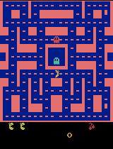

# Class 3: Train a Ms. Pac-Man Agent

The extended **Double DQN** experiment completed **2,000 / 2,000 episodes**. Its mean score on the five unchanged evaluation games increased from **492 to 1,582**: **+1,090 points, a 221.5% increase, or 3.22 times the untrained score**. The original 100-episode DQN achieved **504**, so the new final mean is **+1,078 points, or 213.9% higher**, than that first experiment.

The leaderboard score for this final saved model is **1,582**. The table below reports every game. The submitted model is the final model from this run, not a checkpoint selected by its best evaluation score.

This repository contains the [final executed notebook](pacman_dqn.ipynb), with all 28 code cells executed in order and all outputs retained. It extends the [supplied Pac-Man project](https://github.com/pepealonso95/pacman-dqn). The [original 100-episode experiment](experiments/original_100/README.md), [original notebook](experiments/original_100/pacman_dqn.ipynb), and its evidence remain available for comparison.

The main learning result is better point collection from the same screen-based observations. The gameplay shows more corridor clearing and successful power-pellet use in some recordings. Every final evaluation score improved over its matching untrained baseline, but scores still varied from 980 to 2,530. This supports a more useful learned policy, without establishing reliable survival or complete understanding of the game.

## Choices and expectation recorded before training

| Setting | Choice | Reason |
| --- | ---: | --- |
| Exploration | 0.10 | After warm-up, about one in ten decisions is random and the rest follow learned action values. Reducing the first run's 20% random decisions was intended to let useful movement patterns continue more often while still trying alternatives. |
| Episode budget | 2,000 | Give the agent twenty times the original episode budget to revisit situations and learn from more experience. A two-hour training cap reserved time within the three-hour overall budget for evaluation and saving the evidence. |
| Learning rate | 0.0001 | Keep the supplied reference rate for relatively small network updates. Retaining the original rate avoided adding another change while increasing experience and replay memory. |

The [before-training plan](experiment_plan.md) expected a larger experience budget and replay memory to improve point collection, with no guarantee of a higher score. Exploration was 100% for the first 1,000 decisions, then stayed constant at **10%**. No exploration-decay schedule was introduced.

These choices were a practical experiment within the available time, not settings proven to be optimal. The final five-game mean improved as hoped, but several training settings changed together, so the result cannot identify which individual change helped most.

Two extensions to the supplied DQN were explicitly chosen and documented:

- **Double DQN:** the online network chooses the next action; the target network estimates that chosen action's value. Separating selection from valuation aims to reduce overoptimistic action-value estimates. [Double DQN paper](https://arxiv.org/abs/1509.06461).
- **Replay capacity 20,000**, increased from 5,000: keep four times as many past experiences before replacing them. Random training batches can therefore draw from a broader set of situations spanning more games. The tradeoff is greater memory use.

An operational **2-hour training cap** saves the current model through the notebook's interruption path, then allows final evaluation and archiving. This cap does not change the per-game evaluation time limit. The network architecture, observations, actions, game setup, reward clipping, training seed, and evaluation settings remain unchanged. This run starts from fresh weights and fresh replay memory; it does not resume the first experiment.

The assignment allows explained changes to other hyperparameters and optional custom agents. Replay capacity is an additional hyperparameter; Double DQN is disclosed as an algorithm extension to the supplied implementation.

## Actual run

The run completed all **2,000 requested episodes** before the 2-hour training cap; it was not interrupted.

| Measure | Recorded result |
| --- | --- |
| Run ID | `20260915_203342_502034` |
| Status | `completed` |
| Episodes requested / completed | 2,000 / 2,000 |
| Training decisions | 1,318,637 |
| Learning updates | 329,410 |
| Training elapsed time | 5,919.556 seconds (1:38:39.600000), including periodic demos |
| Configured training cap | 7,200 seconds |
| Hardware | Apple M4, 16 GiB unified memory |
| Training device | `mps` |
| Runtime | Python 3.12.14; PyTorch 2.14.0 |
| Platform | macOS-26.6.2-arm64-arm-64bit |

The elapsed training time includes periodic demonstration evaluation and saving; it excludes package setup and the separate baseline/final five-game evaluations. It is not the total wall-clock time spent completing the assignment.

There are no partial-episode decisions: the CSV covers every recorded training decision.

The network received **329,410 learning updates**. The verified trained weights differ from the untrained weights and remain finite. This establishes parameter learning, not mastery of the game.

Evidence: [training_summary.json](results/training_summary.json), [training.csv](results/training.csv), [config.json](results/config.json), [environment.txt](results/environment.txt), [verification.json](results/verification.json), and [source provenance](results/provenance.json).

## All five evaluation games

Both new-run evaluations use the same five seeds, **5% exploration**, and **3,000-decision limit per game**. Evaluation never updates the model. The baseline is a fresh **untrained neural network**, not a random-action agent. The original 100-episode result used these same evaluation settings.

| Game | Seed | New-run untrained baseline | Original 100-episode DQN | New final trained agent | Change from new baseline |
| --- | ---: | ---: | ---: | ---: | ---: |
| 1 | 101 | 350 | 280 | 2,310 | +1,960 |
| 2 | 202 | 500 | 550 | 2,530 | +2,030 |
| 3 | 303 | 320 | 310 | 1,000 | +680 |
| 4 | 404 | 800 | 620 | 1,090 | +290 |
| 5 | 505 | 490 | 760 | 980 | +490 |
| **Mean** | | **492** | **504** | **1,582** | **+1,090.0** |

Relative to the new baseline, **5 games improved, 0 worsened, and 0 were unchanged**. Time-limited games: **0 before / 0 after**.

Machine-readable evidence: [all new comparison scores](results/comparison.json), [baseline.json](results/baseline.json), and [original comparison](experiments/original_100/results/comparison.json).

The final policy earned a higher mean score on this fixed five-game comparison. The percentage increase is calculated as `(1,582 - 492) / 492 × 100 = 221.5%`. All five games improved, so the gain is not solely one exceptional game. However, these five fixed seeds and one training run do not establish consistent performance across all possible games.

## Gameplay evidence

Each GIF shows at most the first 20 seconds of game time, played approximately 4× faster and looping twice. The associated score covers the entire evaluated game, not just the excerpt. Open or reload a GIF to replay it.

**Untrained network — seed 101, full-game score 350.**


**Best of the five final trained games — seed 202, full-game score 2,530.** This is the best game of the final saved model, not a model chosen from all checkpoints.


**Gameplay interpretation:** In the untrained seed-101 excerpt, the agent collects some nearby points but loses lives and reaches 350 points by the end of the clip. The final model's seed-101 demonstration at episode 2,000 clears more lower corridors, activates a power pellet (the ghosts turn blue), and reaches 1,970 points within the recorded excerpt while retaining its lives. The episode-1,800 sample also shows lower-corridor clearing and a power pellet, whereas episode 1,375 still loses a life. These recordings support improved point collection and some better survival, with mistakes remaining.

The best final full game is seed 202, at 2,530 points. Its displayed excerpt reaches only 580 points: “best” refers to the whole game, not the first 20 seconds. It moves through several corridors and retains its lives during that excerpt. Neither this selected clip nor the scores demonstrate reliable ghost avoidance, maze mastery, or an understanding of scoreboard digits. The quantitative conclusion comes from all five full-game scores.

### Every intermediate gameplay sample

The notebook saved a separate demonstration and playback checkpoint every 25 completed episodes. All intermediate GIFs from this run are embedded below. These demonstrations use seed 101 and are single-game scores, not official five-game evaluation means. Raw records: [demo_scores.json](results/demo_scores.json).

<details>
<summary>Episodes 25–250 (10 gameplay samples)</summary>

**Episode 25 — seed 101, full-game score 570.**


**Episode 50 — seed 101, full-game score 880.**


**Episode 75 — seed 101, full-game score 290.**


**Episode 100 — seed 101, full-game score 410.**


**Episode 125 — seed 101, full-game score 870.**



**Episode 150 — seed 101, full-game score 500.**


**Episode 175 — seed 101, full-game score 740.**


**Episode 200 — seed 101, full-game score 500.**


**Episode 225 — seed 101, full-game score 460.**


**Episode 250 — seed 101, full-game score 350.**


</details>

<details>
<summary>Episodes 275–500 (10 gameplay samples)</summary>

**Episode 275 — seed 101, full-game score 710.**


**Episode 300 — seed 101, full-game score 860.**


**Episode 325 — seed 101, full-game score 1,210.**


**Episode 350 — seed 101, full-game score 910.**


**Episode 375 — seed 101, full-game score 1,280.**


**Episode 400 — seed 101, full-game score 490.**


**Episode 425 — seed 101, full-game score 890.**


**Episode 450 — seed 101, full-game score 1,200.**


**Episode 475 — seed 101, full-game score 910.**


**Episode 500 — seed 101, full-game score 460.**


</details>

<details>
<summary>Episodes 525–750 (10 gameplay samples)</summary>

**Episode 525 — seed 101, full-game score 810.**


**Episode 550 — seed 101, full-game score 770.**


**Episode 575 — seed 101, full-game score 1,200.**


**Episode 600 — seed 101, full-game score 540.**


**Episode 625 — seed 101, full-game score 300.**


**Episode 650 — seed 101, full-game score 480.**


**Episode 675 — seed 101, full-game score 660.**


**Episode 700 — seed 101, full-game score 340.**


**Episode 725 — seed 101, full-game score 1,100.**


**Episode 750 — seed 101, full-game score 870.**


</details>

<details>
<summary>Episodes 775–1000 (10 gameplay samples)</summary>

**Episode 775 — seed 101, full-game score 1,070.**


**Episode 800 — seed 101, full-game score 760.**


**Episode 825 — seed 101, full-game score 840.**


**Episode 850 — seed 101, full-game score 410.**


**Episode 875 — seed 101, full-game score 770.**


**Episode 900 — seed 101, full-game score 750.**


**Episode 925 — seed 101, full-game score 530.**


**Episode 950 — seed 101, full-game score 540.**


**Episode 975 — seed 101, full-game score 540.**


**Episode 1000 — seed 101, full-game score 560.**


</details>

<details>
<summary>Episodes 1025–1250 (10 gameplay samples)</summary>

**Episode 1025 — seed 101, full-game score 2,410.**


**Episode 1050 — seed 101, full-game score 1,320.**


**Episode 1075 — seed 101, full-game score 880.**


**Episode 1100 — seed 101, full-game score 770.**


**Episode 1125 — seed 101, full-game score 1,100.**


**Episode 1150 — seed 101, full-game score 1,090.**


**Episode 1175 — seed 101, full-game score 540.**


**Episode 1200 — seed 101, full-game score 1,940.**


**Episode 1225 — seed 101, full-game score 1,110.**


**Episode 1250 — seed 101, full-game score 490.**


</details>

<details>
<summary>Episodes 1275–1500 (10 gameplay samples)</summary>

**Episode 1275 — seed 101, full-game score 420.**


**Episode 1300 — seed 101, full-game score 1,370.**


**Episode 1325 — seed 101, full-game score 1,710.**


**Episode 1350 — seed 101, full-game score 1,200.**


**Episode 1375 — seed 101, full-game score 1,500.**


**Episode 1400 — seed 101, full-game score 1,000.**


**Episode 1425 — seed 101, full-game score 1,670.**


**Episode 1450 — seed 101, full-game score 780.**


**Episode 1475 — seed 101, full-game score 870.**


**Episode 1500 — seed 101, full-game score 550.**


</details>

<details>
<summary>Episodes 1525–1750 (10 gameplay samples)</summary>

**Episode 1525 — seed 101, full-game score 920.**


**Episode 1550 — seed 101, full-game score 950.**


**Episode 1575 — seed 101, full-game score 1,160.**


**Episode 1600 — seed 101, full-game score 1,230.**


**Episode 1625 — seed 101, full-game score 1,010.**


**Episode 1650 — seed 101, full-game score 1,500.**


**Episode 1675 — seed 101, full-game score 1,560.**


**Episode 1700 — seed 101, full-game score 1,040.**


**Episode 1725 — seed 101, full-game score 1,030.**


**Episode 1750 — seed 101, full-game score 1,150.**


</details>

<details>
<summary>Episodes 1775–2000 (10 gameplay samples)</summary>

**Episode 1775 — seed 101, full-game score 990.**


**Episode 1800 — seed 101, full-game score 1,880.**


**Episode 1825 — seed 101, full-game score 680.**


**Episode 1850 — seed 101, full-game score 940.**


**Episode 1875 — seed 101, full-game score 630.**


**Episode 1900 — seed 101, full-game score 890.**


**Episode 1925 — seed 101, full-game score 1,040.**


**Episode 1950 — seed 101, full-game score 1,870.**


**Episode 1975 — seed 101, full-game score 930.**


**Episode 2000 — seed 101, full-game score 2,310.**


</details>

## Training curves and what the agent learned


The dashboard shows raw training scores with a rolling average of up to 25 games, average update loss per episode, and the episode's final exploration rate. The warm-up may end partway through an episode. Training uses different seeds and 10% exploration, so training scores are not substitutes for the fixed evaluation scores.

Non-overlapping training blocks provide another view of the score trend:

| Completed episodes | Games in block | Mean raw training score | Mean episode loss |
| --- | ---: | ---: | ---: |
| 1–250 | 250 | 749.2 | 0.07979 |
| 251–500 | 250 | 790.3 | 0.11551 |
| 501–750 | 250 | 773.9 | 0.13081 |
| 751–1000 | 250 | 960.7 | 0.13288 |
| 1001–1250 | 250 | 968.5 | 0.12886 |
| 1251–1500 | 250 | 1,002 | 0.13346 |
| 1501–1750 | 250 | 1,106.8 | 0.12397 |
| 1751–2000 | 250 | 1,111.2 | 0.12746 |

All eight blocks contain 250 completed episodes. Detailed 25-episode block averages and the original measurements are available in [report_data.json](results/report_data.json) and [training.csv](results/training.csv). DQN's target values change as learning proceeds, so loss is not a direct measure of gameplay quality. Lower loss does not guarantee better play.

The first 250 training games averaged **749.2 points**; the last 250 averaged **1,111.16**, an increase of **48.3%**. Progress was uneven, including a decline in episodes 501–750. Mean episode loss was higher in the last block than the first even though scores improved. This is why the evaluation scores and gameplay, rather than a low loss value alone, determine the conclusion.

**Observations:** four consecutive grayscale game screens, each 84 × 84 pixels, provide positions and recent movement. The network receives pixels, not explicit ghost coordinates or a hand-coded map.

**Actions:** nine joystick choices: no movement, up, right, left, down, and the four diagonals. Each decision spans four emulator frames. The unchanged sticky-action setting can repeat the previous action.

**Rewards:** game points provide a numeric reward directly from the emulator. The agent does not need to read scoreboard digits to receive this signal. Training clips each decision's reward to [-1, 1], while all reported scores retain the original game points. The network learns estimates of immediate and discounted future reward for each action using replayed experiences.

**How learning happened:** the agent stored examples of a screen stack, its chosen move, the resulting reward, and the next screen stack. During each update it sampled stored examples and adjusted its network's action-value predictions toward immediate rewards plus estimated future rewards. Double DQN used the online network to choose the next action and the target network to value that choice. Across **329,410 updates**, the network developed action preferences associated with higher rewards. It was not given written instructions to follow pellets or avoid ghosts.

**What it appears to have learned:** the combination of improved scores and the reviewed clips suggests useful steering and point-collection patterns, including routes that reach power pellets. We can observe those behaviors; we cannot infer that it understands concepts such as “ghost,” “danger,” or scoreboard digits in a human sense. Some successful short clips also preserve lives longer than the baseline clip, but the full evaluations still end in game over.

The full-game records also show some improved survival: average game length rose from **589 to 723.8 decisions (+22.9%)**, with longer games on four of five seeds. Seed 404 ended sooner despite earning more points, so longer survival alone does not explain every score increase. These lengths are recorded in [comparison.json](results/comparison.json).

**Observed limitation:** the trained agent is still inconsistent: final scores range from **980 to 2,530**, and all five games end before the 3,000-decision time limit. It has improved point collection but has not learned dependable long-term survival. Intermediate demonstrations also fluctuate—for example, the episode-1,800 game scores 1,880, while episode 1,875 scores 630.

Only one training seed and five evaluation games were used, so these results do not establish dependable performance on unseen games. Episode budget, exploration, replay capacity, and the learning rule all changed together relative to the first run, so their individual contributions cannot be isolated.

**Next experiment:** change only the learning rate from **0.0001 to 0.00005**, keeping Double DQN, replay capacity 20,000, exploration 0.10, requested episode budget 2,000, the two-hour cap, and all evaluation settings fixed. Smaller updates may make learned action values less volatile; this is a hypothesis to test, not an established improvement. Record the actual decisions and updates again because the time cap may yield different completed budgets. This next experiment has not been performed.

## Open and reproduce

Open [pacman_dqn.ipynb](pacman_dqn.ipynb) on GitHub to inspect the saved scores, plot, and gameplay without rerunning. To execute it, [open the notebook in Google Colab](https://colab.research.google.com/github/sbardacosta-code/class-3-pacman-dqn/blob/main/pacman_dqn.ipynb), select a GPU if available, and choose Run All. Download both the executed `.ipynb` and results ZIP before ending the session. Do not clear the cell outputs.

For local Jupyter or VS Code, use a Python 3.11–3.13 kernel and keep `pacman_player.py` beside the notebook for optional popup playback. The notebook installs its packages and tests CUDA, Apple MPS, or CPU automatically. Read the documented extensions, confirm the three settings, and run every cell in order. Run All starts a fresh experiment and a new results directory; it does not resume a saved checkpoint.

The programmatic execution method used for this repository is:

```bash
python3.12 -m venv .venv
source .venv/bin/activate
python -m pip install -r requirements.txt
python run_notebook.py
```

[run_notebook.py](run_notebook.py) executes the notebook sequentially and saves its real outputs after each code cell. [requirements.txt](requirements.txt) records the environment used here; the notebook's installer retains its version ranges. Hardware, package changes, and GPU nondeterminism can change scores even with the same seeds.

After all cells finish, evidence can be assembled and checked with:

```bash
python scripts/build_submission.py --run pacman_runs/20260915_203342_502034
```

[build_submission.py](scripts/build_submission.py) verifies all 28 ordered execution counts, evaluation invariants, evaluation means, model weights, all periodic checkpoints, and the ZIP. It checks that every notebook GIF matches the corresponding saved file byte for byte. GitHub does not directly render the notebook's `image/gif` output format, so it adds an HTML image representation pointing to the identical public GIF. Original embedded GIF bytes and all other notebook outputs are preserved, and no cell source is changed by this display step.

## Full archive and checkpoints

The complete final-run archive is retained locally at **`pacman_runs/20260915_203342_502034.zip`**, with extracted files in **`pacman_runs/20260915_203342_502034/`**. Its absolute location on the experiment machine is `/Users/sebastianbardacostaartagaveytia/Documents/ChatGPT/Class 3/pacman_runs/20260915_203342_502034.zip`.

The ZIP contains `untrained.pt`, `trained.pt`, and all **80 intermediate playback checkpoints**, saved every 25 completed episodes, together with the generated evidence. Large checkpoints and ZIPs are excluded from Git; the required small artifacts and every GIF are copied into `results/`. The local ZIP's SHA-256, integrity check, and checkpoint inventory are recorded in [verification.json](results/verification.json).

The checkpoints support playback, not exact training resumption: they contain model weights but omit replay memory, optimizer state, and emulator state. The original run's archive also remains local, as documented in the [preserved first report](experiments/original_100/README.md).

Public submission repository: [https://github.com/sbardacosta-code/class-3-pacman-dqn](https://github.com/sbardacosta-code/class-3-pacman-dqn).
