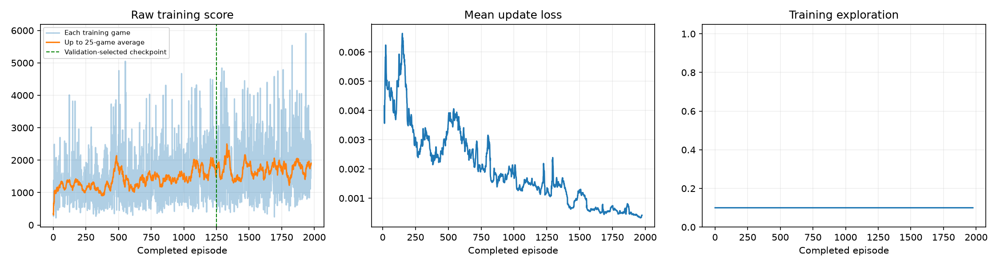
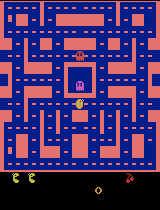
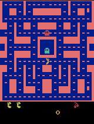

# Overnight experiment: preserved first stage

This is the completed first stage of the [overnight continuation](../../README.md). Its selected model is an intermediate result. The continuation recipe was fixed before these classroom scores and does not use them to choose training settings.

Run `20260921_005003_092029`: status `time_budget`, 1,975 completed games, 1,535,392 decisions, 381,349 recorded updates, and 7200.011 training seconds.

[Executed notebook](pacman_dqn.ipynb) · [Config](results/config.json) · [Training CSV](results/training.csv) · [Summary](results/training_summary.json) · [Comparison](results/comparison.json) · [Selection](results/model_selection.json) · [Initial plan](experiment_plan.md) · [Overnight extension](overnight_plan.md)

| Seed | Fresh baseline | Stage-one selected |
| --- | ---: | ---: |
| 101 | 350 | 2500 |
| 202 | 500 | 2120 |
| 303 | 320 | 2490 |
| 404 | 800 | 2520 |
| 505 | 490 | 1130 |
| Mean | 492 | 2152 |

The GIFs show at most the first 20 seconds. The final GIF is the best of five games; it does not demonstrate typical performance. The full stage-one ZIP and all large checkpoints remain local under `pacman_runs/`.

Every stage-one intermediate gameplay GIF

