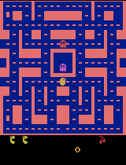
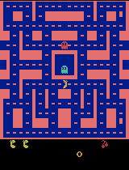
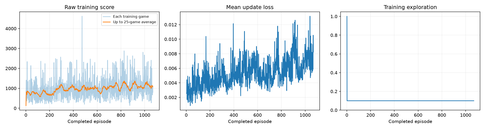

# Class 3: Train a Ms. Pac-Man Agent

Archived snapshot of commit [`97919b50`](https://github.com/sbardacosta-code/class-3-pacman-dqn/tree/97919b50f93dc10ee85b24f54ab35af9ef9dac46). This report describes the interrupted 1,069-episode scaled-reward experiment. Its notebook and evidence are preserved here; historical execution commands refer to the original repository-root layout at that commit.

The **scaled-reward Double DQN** experiment completed **1,069 / 2,000 episodes**. Its mean score on the five unchanged evaluation games increased from **492 to 1,450** (+958.0 points; +194.7%). The previous 2,000-episode clipped-reward agent scored **1,582**; this experiment's mean differs by **-132.0 points**. The original 100-episode DQN scored **504**.

The leaderboard score for this final saved model is **1,450**. The table below reports every game. The submitted model is the final model from this run, not a checkpoint selected by its best evaluation score.

The earlier **1,582** classroom mean and its full evidence remain available in the [preserved clipped-reward experiment](../clipped_2000/README.md). This report keeps the latest outcome visible even when its mean is lower.

This repository contains the [final executed notebook](pacman_dqn.ipynb), with all 28 code cells executed in order and all outputs retained. It extends the [supplied Pac-Man project](https://github.com/pepealonso95/pacman-dqn). The [original 100-episode experiment](../original_100/README.md), [original notebook](../original_100/pacman_dqn.ipynb), [previous clipped-reward experiment](../clipped_2000/README.md), and [previous executed notebook](../clipped_2000/pacman_dqn.ipynb) remain available with their evidence.

## Choices and expectation recorded before training

| Setting | Choice | Reason |
| --- | ---: | --- |
| Exploration | 0.10 | Retain the previous balance between trying alternatives and using learned action preferences. |
| Episode budget | 2,000 | Match the previous requested budget within the same two-hour training cap. |
| Learning rate | 0.0001 | Keep the update size fixed so reward transformation is the only changed learning setting. |

The [before-training plan](experiment_plan.md) proposed preserving the relative value of game points. The hypothesis was that making a 200-point gain more valuable than a 10-point gain would encourage higher-value play. The previous reward clipped both to +1; the new reward stores **raw points × 0.01 without clipping**, producing +2 and +0.1 respectively. Removing clipping can also make learning less stable, so improvement was not guaranteed. **No life-loss penalty was added.** Testing that separately avoids changing two reward properties at once.

Exploration was 100% for the first 1,000 decisions, then stayed constant at **10%**. No exploration-decay schedule was introduced.

The following extensions from the previous experiment were retained unchanged:

- **Double DQN:** the online network chooses the next action; the target network estimates that chosen action's value. Separating selection from valuation aims to reduce overoptimistic action-value estimates. [Double DQN paper](https://arxiv.org/abs/1509.06461).
- **Replay capacity 20,000**, already increased from 5,000: retain a wider range of past experiences for random training batches.

An operational **2-hour training cap** saves the current model through the notebook's interruption path, then allows final evaluation and archiving. This cap does not change the per-game evaluation time limit. The network architecture, observations, actions, game setup, training seed, and evaluation settings remain unchanged. All non-reward training settings match the previous 2,000-episode run. This run starts with fresh weights, optimizer, and replay memory; it is not another 2,000 episodes appended to the previous model.

The assignment allows explained changes to other hyperparameters and optional custom agents. Replay capacity is an additional hyperparameter; Double DQN is disclosed as an algorithm extension to the supplied implementation. The new training-reward transformation is also disclosed. Classroom evaluation still reports the original game points under the original settings.

## Actual run

**This run was manually interrupted once**, after **1,069 of 2,000 requested episodes**. Its recorded status is `interrupted`. The notebook's elapsed training timer was **1h 16m 28s**, below the configured **7,200-second cap**; the automatic cap did not stop this run. Evaluation and saving were then allowed to finish.

The interruption followed an apparent host or session pause. Monitoring observations jumped from approximately 22:40 UTC to 02:39 UTC while the notebook's training timer advanced only from about 57 to 75 minutes. The cause of that gap was not confirmed. The original three-hour wall-clock window had already been exceeded when monitoring resumed, so training was stopped rather than continuing toward 2,000 episodes. The elapsed training value below must not be read as the full wall-clock duration.

| Measure | Recorded result |
| --- | --- |
| Run ID | `20260920_152728_434799` |
| Status | `interrupted` |
| Episodes requested / completed | 2,000 / 1,069 |
| Training decisions | 744,500 |
| Learning updates | 185,875 |
| Notebook training timer | 4,587.930 seconds (1h 16m 28s), including periodic demos |
| Configured training cap | 7,200 seconds |
| Hardware | Apple M4, 16 GiB unified memory |
| Training device | `mps` |
| Runtime | Python 3.12.14; PyTorch 2.14.0 |
| Platform | macOS-26.6.2-arm64-arm-64bit |

The elapsed training time includes periodic demonstration evaluation and saving; it excludes package setup and the separate baseline/final five-game evaluations. It is not the total wall-clock time spent completing the assignment.

The final interrupted game contributed **480 decisions** that are included in the total decision count. The checkpoint preserves the weights at interruption. That game is not counted as a completed episode or included as a CSV row.

The recorded counter reports **185,875 learning updates**. The verified trained weights differ from the untrained weights and remain finite. This establishes parameter learning, not mastery of the game. The interruption occurred at a scheduled update boundary before its counter increment, leaving the recorded counter one below the count implied by the decision schedule. An extra completed update is not assumed or added to the reported counter.

For comparison, the previous clipped-reward run completed **2,000 episodes**, **1,318,637 decisions**, and **329,410 updates** in **1h 38m 40s**. Matching the episode request does not match the number of decisions or updates: different learned policies produce different game lengths. The interruption also left this run with fewer completed episodes, making the actual training budgets substantially unequal.

Evidence: [training_summary.json](results/training_summary.json), [training.csv](results/training.csv), [config.json](results/config.json), [environment.txt](results/environment.txt), [verification.json](results/verification.json), and [source provenance](results/provenance.json).

## All five evaluation games

Both new-run evaluations use the same five seeds, **5% exploration**, and **3,000-decision limit per game**. Evaluation never updates the model. The baseline is a fresh **untrained neural network**, not a random-action agent. The original 100-episode and previous 2,000-episode results used these same evaluation settings. All values in this section are raw game points, not scaled learning rewards.

| Game | Seed | New untrained baseline | Original 100 episodes | Clipped 2,000 episodes | New scaled-reward agent | Change vs. clipped |
| --- | ---: | ---: | ---: | ---: | ---: | ---: |
| 1 | 101 | 350 | 280 | 2,310 | 1,430 | -880 |
| 2 | 202 | 500 | 550 | 2,530 | 1,050 | -1,480 |
| 3 | 303 | 320 | 310 | 1,000 | 1,860 | +860 |
| 4 | 404 | 800 | 620 | 1,090 | 1,930 | +840 |
| 5 | 505 | 490 | 760 | 980 | 980 | +0 |
| **Mean** | | **492** | **504** | **1,582** | **1,450** | **-132.0** |

Relative to the new baseline, **5 games improved, 0 worsened, and 0 were unchanged**. Relative to the clipped agent, **2 improved, 2 worsened, and 1 were unchanged**. Time-limited games: **0 before / 0 after**.

Machine-readable evidence: [all new comparison scores](results/comparison.json), [baseline.json](results/baseline.json), and the preserved [clipped comparison](../clipped_2000/results/comparison.json) and [original comparison](../original_100/results/comparison.json).

The final policy earned a higher mean score on this fixed five-game comparison. That supports improvement under these evaluation conditions; it does not establish consistent performance across all possible games.

The scaled-reward policy scored lower than the previous clipped-reward policy. Its mean was **132.0 points (8.3%) lower** on these five games. The lower result is preserved rather than reported as an improvement. This run completed 1,069 episodes versus 2,000 for the clipped agent, with fewer recorded training decisions and updates. The unequal training budget is a substantial confounding factor: the score difference cannot be attributed solely to the reward transformation.

### Progress toward consistent 3,000+ scores

A high mean alone does not establish consistency. The minimum, median, and number of games reaching 3,000 help show how uneven performance is.

| Version | Mean | Median | Minimum | Maximum | Games ≥3,000 |
| --- | ---: | ---: | ---: | ---: | ---: |
| New untrained baseline | 492 | 490 | 320 | 800 | 0/5 (0%) |
| Original 100 episodes | 504 | 550 | 280 | 760 | 0/5 (0%) |
| Clipped 2,000 episodes | 1,582 | 1,090 | 980 | 2,530 | 0/5 (0%) |
| New scaled-reward agent | 1,450 | 1,430 | 980 | 1,930 | 0/5 (0%) |

**Only 0 of 5 classroom games reached 3,000 points. The target of consistently scoring 3,000+ was not met on this evaluation set.**

### Additional validation on separate seeds

Both final saved models were evaluated on **20 additional seeds** under the same exploration and per-game time limit as classroom evaluation. The models receive no learning updates during these games. These results are a separate check of consistency; they do not replace the five official scores or change the classroom leaderboard mean. Every validation game is reported below, including low scores.

| Model | Mean | Median | Minimum | Maximum | Games ≥3,000 |
| --- | ---: | ---: | ---: | ---: | ---: |
| Previous clipped reward | 1,507 | 1,425 | 550 | 3,330 | 1/20 (5%) |
| New scaled reward | 1,516.5 | 1,285 | 790 | 4,600 | 1/20 (5%) |

| Game | Seed | Previous clipped reward | New scaled reward | Change |
| --- | ---: | ---: | ---: | ---: |
| 1 | 10001 | 1,230 | 1,500 | +270 |
| 2 | 10002 | 1,510 | 2,400 | +890 |
| 3 | 10003 | 1,470 | 860 | -610 |
| 4 | 10004 | 1,510 | 1,250 | -260 |
| 5 | 10005 | 3,330 | 790 | -2,540 |
| 6 | 10006 | 1,630 | 1,120 | -510 |
| 7 | 10007 | 1,510 | 950 | -560 |
| 8 | 10008 | 1,840 | 1,050 | -790 |
| 9 | 10009 | 1,350 | 1,440 | +90 |
| 10 | 10010 | 1,070 | 1,570 | +500 |
| 11 | 10011 | 1,500 | 940 | -560 |
| 12 | 10012 | 1,370 | 850 | -520 |
| 13 | 10013 | 1,380 | 820 | -560 |
| 14 | 10014 | 1,250 | 1,030 | -220 |
| 15 | 10015 | 1,190 | 1,320 | +130 |
| 16 | 10016 | 1,160 | 1,660 | +500 |
| 17 | 10017 | 1,830 | 2,880 | +1,050 |
| 18 | 10018 | 1,170 | 4,600 | +3,430 |
| 19 | 10019 | 2,290 | 1,620 | -670 |
| 20 | 10020 | 550 | 1,680 | +1,130 |

The new agent reached 3,000 in 1/20 additional games. The complete score distribution, rather than its best game, shows the remaining gap to dependable 3,000+ play. The new mean is only 9.5 points (0.63%) higher, while its median is lower: 1,285 versus 1,425. Its 4,600-point best game helps lift the mean; both models reached 3,000 only once in 20 games. These results do not show a convincing improvement in consistency. The models also received unequal amounts of training, so this is not a controlled estimate of the effect of reward scaling.

Validation settings, all scores and game lengths, time-limit indicators, and model identities are saved in [heldout_validation.json](results/heldout_validation.json) and [heldout_validation.csv](results/heldout_validation.csv). Both models come from single training runs; these additional games do not measure variation across retraining seeds.

To reproduce this supplemental evaluation with the locally retained checkpoints:

```bash
.venv/bin/python scripts/validate_generalization.py --run pacman_runs/20260920_152728_434799 --reference-run pacman_runs/20260915_203342_502034
```

[validate_generalization.py](scripts/validate_generalization.py) writes its output under `.execution/heldout_20260920_152728_434799/`. The resulting JSON and CSV are copied to `results/` for publication. They are supplemental artifacts produced after training, separate from the notebook-generated ZIP.

## Gameplay evidence

Each GIF shows at most the first 20 seconds of game time, played approximately 4× faster and looping twice. The associated score covers the entire evaluated game, not just the excerpt. Open or reload a GIF to replay it.

**Untrained network — seed 101, full-game score 350.**


**Best of the five final trained games — seed 404, full-game score 1,930.** This is the best game of the final saved model, not a model chosen from all checkpoints.



**Gameplay interpretation:** In the best final clip, Ms. Pac-Man reaches a power pellet on the right side, the ghosts turn blue, and the score reaches 1,110 by approximately 17 seconds. Both reserve-life icons remain visible through the excerpt. The score then stays at 1,110 for its remaining few seconds; the complete game eventually scores 1,930. The episode-1,050 sample reaches 580 within the excerpt and 770 over its complete game. By contrast, the episode-850 sample loses a life early and scores only 170 over its complete game. These visible setbacks show that learning is uneven. The baseline also loses lives and finishes with 350. The final best clip uses seed 404 while the baseline and intermediate clips use seed 101, so this is not a matched-seed visual comparison. The best clip is selected evidence and cannot establish typical play, reliable ghost avoidance, fruit-seeking, or an understanding of the scoreboard digits.

### Every intermediate gameplay sample

The notebook saved a separate demonstration and playback checkpoint every 25 completed episodes. All intermediate GIFs from this run are embedded below. These demonstrations use seed 101 and are single-game scores, not official five-game evaluation means. Raw records: [demo_scores.json](results/demo_scores.json).

<details>
<summary>Episodes 25–250 (10 gameplay samples)</summary>

**Episode 25 — seed 101, full-game score 400.**



**Episode 50 — seed 101, full-game score 1,570.**


**Episode 75 — seed 101, full-game score 270.**


**Episode 100 — seed 101, full-game score 270.**


**Episode 125 — seed 101, full-game score 420.**


**Episode 150 — seed 101, full-game score 520.**


**Episode 175 — seed 101, full-game score 420.**


**Episode 200 — seed 101, full-game score 320.**


**Episode 225 — seed 101, full-game score 440.**


**Episode 250 — seed 101, full-game score 770.**


</details>

<details>
<summary>Episodes 275–500 (10 gameplay samples)</summary>

**Episode 275 — seed 101, full-game score 840.**


**Episode 300 — seed 101, full-game score 1,210.**


**Episode 325 — seed 101, full-game score 870.**


**Episode 350 — seed 101, full-game score 750.**


**Episode 375 — seed 101, full-game score 560.**


**Episode 400 — seed 101, full-game score 280.**


**Episode 425 — seed 101, full-game score 660.**


**Episode 450 — seed 101, full-game score 910.**


**Episode 475 — seed 101, full-game score 750.**


**Episode 500 — seed 101, full-game score 430.**


</details>

<details>
<summary>Episodes 525–750 (10 gameplay samples)</summary>

**Episode 525 — seed 101, full-game score 960.**


**Episode 550 — seed 101, full-game score 1,190.**


**Episode 575 — seed 101, full-game score 1,350.**


**Episode 600 — seed 101, full-game score 120.**


**Episode 625 — seed 101, full-game score 300.**


**Episode 650 — seed 101, full-game score 1,760.**


**Episode 675 — seed 101, full-game score 890.**


**Episode 700 — seed 101, full-game score 430.**


**Episode 725 — seed 101, full-game score 1,060.**


**Episode 750 — seed 101, full-game score 700.**


</details>

<details>
<summary>Episodes 775–1000 (10 gameplay samples)</summary>

**Episode 775 — seed 101, full-game score 800.**


**Episode 800 — seed 101, full-game score 770.**


**Episode 825 — seed 101, full-game score 1,290.**


**Episode 850 — seed 101, full-game score 170.**


**Episode 875 — seed 101, full-game score 260.**


**Episode 900 — seed 101, full-game score 850.**


**Episode 925 — seed 101, full-game score 250.**


**Episode 950 — seed 101, full-game score 700.**


**Episode 975 — seed 101, full-game score 930.**


**Episode 1000 — seed 101, full-game score 670.**


</details>

<details>
<summary>Episodes 1025–1050 (2 gameplay samples)</summary>

**Episode 1025 — seed 101, full-game score 650.**


**Episode 1050 — seed 101, full-game score 770.**


</details>

## Training curves and what the agent learned



The dashboard shows raw training scores with a rolling average of up to 25 games, average update loss per episode, and the episode's final exploration rate. The warm-up may end partway through an episode. Training uses different seeds and 10% exploration, so training scores are not substitutes for the fixed evaluation scores.

Non-overlapping training blocks provide another view of the score trend:

| Completed episodes | Games in block | Mean raw training score | Mean episode loss |
| --- | ---: | ---: | ---: |
| 1–250 | 250 | 757.8 | 0.00370 |
| 251–500 | 250 | 990.1 | 0.00508 |
| 501–750 | 250 | 1,004.9 | 0.00538 |
| 751–1000 | 250 | 1,116.6 | 0.00652 |
| 1001–1069 | 69 | 1,116.8 | 0.00748 |

A partial final block is included as recorded. Detailed 25-episode block averages and the original measurements are available in [report_data.json](results/report_data.json) and [training.csv](results/training.csv). DQN's target values change as learning proceeds, so loss is not a direct measure of gameplay quality. Lower loss does not guarantee better play. Loss magnitudes across the clipped and scaled experiments are not directly comparable because the reward and target scales changed.

In this run, the score average rises from roughly 750 in the first 250 games to around 1,100 in later blocks, with substantial fluctuations. Loss is noisy and generally increases rather than steadily falling; the dashboard does not show stable convergence. Exploration stays at 10% after warm-up.

**Observations:** four consecutive grayscale game screens, each 84 × 84 pixels, provide positions and recent movement. The network receives pixels, not explicit ghost coordinates or a hand-coded map.

**Actions:** nine joystick choices: no movement, up, right, left, down, and the four diagonals. Each decision spans four emulator frames. The unchanged sticky-action setting can repeat the previous action.

**Rewards:** game points provide a numeric reward directly from the emulator. The agent does not need to read scoreboard digits to receive this signal. This experiment stores **raw points × 0.01 without clipping** for learning. A decision earning 10, 50, 200, or 400 points therefore gives a training reward of 0.1, 0.5, 2, or 4. In the previous experiment, each of those positive decisions gave +1 after clipping. All reported game scores remain unscaled.

There is **no added survival bonus or penalty for losing a life**. Pellets, power pellets, fruit, and vulnerable ghosts are valuable through the points the game awards. Staying alive can help by providing future opportunities to score, but the training code does not explicitly reward each second of survival. Losing a single life does not by itself end the training episode.

**How learning works:** replay memory stores the screen stack, chosen action, scaled reward, and next screen stack. Each update samples past experiences and adjusts action-value predictions toward the immediate reward plus discounted estimated future rewards. Double DQN uses the online network to select the next action and the target network to estimate its value. The agent receives no written instructions to seek fruit or avoid ghosts, and higher scores alone do not prove that it learned a specific visual concept.

**What the evidence supports:** The recorded counter reports **185,875 learning updates**. The verified trained weights differ from the untrained weights and remain finite. This establishes parameter learning, not mastery of the game. The interruption occurred at a scheduled update boundary before its counter increment, leaving the recorded counter one below the count implied by the decision schedule. An extra completed update is not assumed or added to the reported counter. The scaled-reward policy scored lower than the previous clipped-reward policy. Its mean was **132.0 points (8.3%) lower** on these five games. The lower result is preserved rather than reported as an improvement. This run completed 1,069 episodes versus 2,000 for the clipped agent, with fewer recorded training decisions and updates. The unequal training budget is a substantial confounding factor: the score difference cannot be attributed solely to the reward transformation.

**Observed limitation of this experiment:** this is one training run with a single training seed. The episode-850 GIF demonstrates early life loss, and the additional validation still has only one 3,000-point game out of 20. The classroom comparison has only five evaluation games, and the best short GIF is selected evidence. Only 0 of 5 classroom games reached 3,000 points. The target of consistently scoring 3,000+ was not met on this evaluation set. Reward transformation is the only changed learning setting relative to the clipped 2,000-episode experiment, but different trajectories, actual decisions and updates, and GPU nondeterminism still limit causal conclusions from one run per setting. Relative to the original 100-episode experiment, several settings changed, so that broader comparison cannot isolate their contributions.

**Proposed next experiment, if life loss remains a visible weakness:** keep scaled rewards and every other setting fixed, and add **−0.5 training reward per lost life**. At this scale, that is a cost equivalent to 50 game points. It would test whether an explicit life-loss signal improves survival enough to increase raw scores; it could instead discourage worthwhile risks. This is an experimental starting value, not a proven optimum. Run a no-penalty control and a penalty treatment with a matched training budget before attributing any difference to that single changed setting. Report actual decisions and updates again, and keep evaluation raw scoring and settings unchanged. **No life-loss penalty experiment has been performed in this run.**

## Open and reproduce

Open [pacman_dqn.ipynb](pacman_dqn.ipynb) on GitHub to inspect the saved scores, plot, and gameplay without rerunning. To execute it, [open the notebook in Google Colab](https://colab.research.google.com/github/sbardacosta-code/class-3-pacman-dqn/blob/main/experiments/scaled_1069/pacman_dqn.ipynb), select a GPU if available, and choose Run All. Download both the executed `.ipynb` and results ZIP before ending the session. Do not clear the cell outputs.

For local Jupyter or VS Code, use a Python 3.11–3.13 kernel and keep `pacman_player.py` beside the notebook for optional popup playback. The notebook installs its packages and tests CUDA, Apple MPS, or CPU automatically. Read the documented extensions, confirm the three settings, and run every cell in order. Run All starts a fresh experiment and a new results directory; it does not resume a saved checkpoint.

The programmatic execution method used for this repository is:

```bash
python3.12 -m venv .venv
source .venv/bin/activate
python -m pip install -r requirements.txt
python run_notebook.py
```

[run_notebook.py](run_notebook.py) executes the notebook sequentially and saves its real outputs after each code cell. [requirements.txt](requirements.txt) records the environment used here; the notebook's installer retains its version ranges. Hardware, package changes, and GPU nondeterminism can change scores even with the same seeds.

After all cells finish, evidence can be assembled and checked with:

```bash
python scripts/build_submission.py --run pacman_runs/20260920_152728_434799
```

[build_submission.py](scripts/build_submission.py) verifies all 28 ordered execution counts, evaluation invariants, evaluation means, model weights, all periodic checkpoints, and the ZIP. It checks that every notebook GIF matches the corresponding saved file byte for byte. GitHub does not directly render the notebook's `image/gif` output format, so it adds an HTML image representation pointing to the identical public GIF. Original embedded GIF bytes and all other notebook outputs are preserved, and no cell source is changed by this display step.

## Full archive and checkpoints

The complete final-run archive is retained locally at **`pacman_runs/20260920_152728_434799.zip`**, with extracted files in **`pacman_runs/20260920_152728_434799/`**. Its absolute location on the experiment machine is `/Users/sebastianbardacostaartagaveytia/Documents/ChatGPT/Class 3/pacman_runs/20260920_152728_434799.zip`.

The ZIP contains `untrained.pt`, `trained.pt`, and all **42 intermediate playback checkpoints**, saved every 25 completed episodes, together with the generated evidence. Large checkpoints and ZIPs are excluded from Git; the required small artifacts and every GIF are copied into `results/`. The local ZIP's SHA-256, integrity check, and checkpoint inventory are recorded in [verification.json](results/verification.json).

The checkpoints support playback, not exact training resumption: they contain model weights but omit replay memory, optimizer state, and emulator state. Both earlier archives also remain local, as documented in the [preserved first report](../original_100/README.md) and [preserved clipped-reward report](../clipped_2000/README.md).

Public submission repository: [https://github.com/sbardacosta-code/class-3-pacman-dqn](https://github.com/sbardacosta-code/class-3-pacman-dqn).
